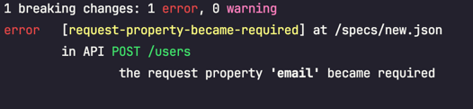

# oadiff with .NET and Swashbuckle
Small example for how to use oasdiff in a pipeline to check for breaking changes during a pull request.

### Breaking Change
Check [pull request](https://github.com/ff-jonsedan/oasdiff-swashbuckle-example/pull/1) for changes. By making `email` a required input property for `CreateUser` operation, the contract is broken.



### Resources
- https://www.nuget.org/packages/Swashbuckle.AspNetCore.Cli
  - Used to extract swagger.json from the application
- https://github.com/Tufin/oasdiff


## Usage

```yaml
name: "Check API for breaking changes"
on:
  pull_request:
    branches:
      - main
jobs:
  job1:
    permissions:
      contents: read
    runs-on: ubuntu-latest
    steps:
      - name: "Checkout PR"
        uses: actions/checkout@v4
        with:
          path: "pr"
      - name: "Checkout main branch"
        uses: actions/checkout@v4
        with:
          ref: "main"
          path: "base"
      - run: mkdir -p ./specs
      - name: "Generate PR OpenAPI file"
        working-directory: ./pr/src
        run: |
          dotnet build
          dotnet tool restore
          dotnet tool run swagger tofile --output ../../specs/pr.json WebApplication1/bin/Debug/net6.0/WebApplication1.dll v1
      - name: "Generate main branch OpenAPI file"
        working-directory: ./base/src
        run: |
          dotnet build
          dotnet tool restore
          dotnet tool run swagger tofile --output ../../specs/base.json WebApplication1/bin/Debug/net6.0/WebApplication1.dll v1
      - name: "Setup oasdiff"
        run: |
          wget https://github.com/Tufin/oasdiff/releases/download/v1.8.1/oasdiff_1.8.1_linux_amd64.tar.gz
          tar -xf oasdiff_1.8.1_linux_amd64.tar.gz
          chmod +x oasdiff
      - name: "Check for breaking changes"
        run: |
          ./oasdiff breaking ./specs/base.json ./specs/pr.json -c -o ERR
```